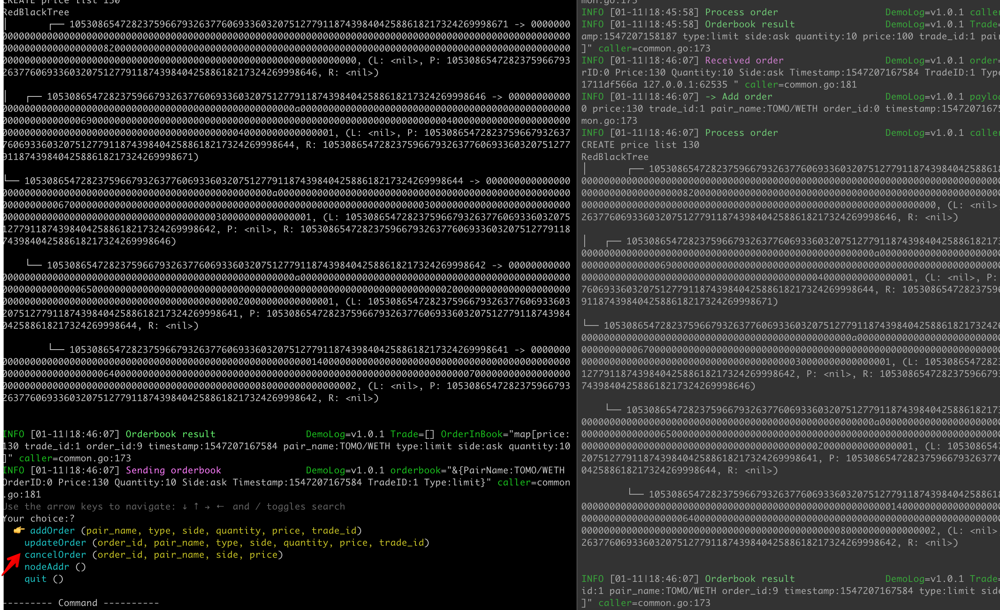

## How to start

Copy or link this folder to GOPATH/src  
`ln -sF $PWD $GOPATH/src/github.com/novaprotocolio/orderbook`

By default we use POA consensus for demo  
Assume you are in root folder  
Node1: `yarn node1 -boot enode://6cf1b4f4391d387904c48fc18403b49d0df0588e0a20511f0ff830de30867f3e12daaf6138ccfc2583b4b76b7b5bc0b7493e1ae1cb5ae951cd1f6221b147ec50@127.0.0.1:30310 -console [-mining true]`  
Node2: `yarn node2 -boot enode://6cf1b4f4391d387904c48fc18403b49d0df0588e0a20511f0ff830de30867f3e12daaf6138ccfc2583b4b76b7b5bc0b7493e1ae1cb5ae951cd1f6221b147ec50@127.0.0.1:30310 -console [-mining true]`  
Backend: `yarn backend`

**DEMO**  

